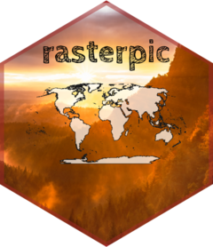

<!-- README.md is generated from README.Rmd. Please edit that file -->

```{r, include = FALSE}
knitr::opts_chunk$set(
  collapse = TRUE,
  comment = "#>",
  warning = FALSE,
  message = FALSE,
  tidy = "styler",
  dev = "ragg_png",
  fig.path = "man/figures/README-",
  dpi = 300,
  out.width = "50%",
  fig.align = "center"
)
```

# rasterpic 

<!-- badges: start -->

[](https://CRAN.R-project.org/package=rasterpic)
[](https://cran.r-project.org/web/checks/check_results_rasterpic.html)
[](https://github.com/dieghernan/rasterpic/actions/workflows/check-full.yaml)
[](https://app.codecov.io/gh/dieghernan/rasterpic)
[](https://dieghernan.r-universe.dev/)
[](https://doi.org/10.5281/zenodo.5910095)
[](https://www.repostatus.org/#active)
[](https://CRAN.R-project.org/package=rasterpic)

<!-- badges: end -->

**rasterpic** is a tiny package with one single goal: to transform an image into
a spatial raster.

## Installation

Install `rasterpic` from
[**CRAN**](https://CRAN.R-project.org/package=rasterpic):

```{r, eval=FALSE}
install.packages("rasterpic")
```

You can install the developing version of **rasterpic** with:

```{r, eval=FALSE}
devtools::install_github("dieghernan/rasterpic")
```

Alternatively, you can install **rasterpic** using the
[r-universe](https://dieghernan.r-universe.dev/ui#builds):

```{r, eval=FALSE}
# Enable this universe
options(repos = c(
  dieghernan = "https://dieghernan.r-universe.dev",
  CRAN = "https://cloud.r-project.org"
))
install.packages("rasterpic")
```

## Example

This package allows you to create cool maps by using a wide variety of objects:

-   Spatial object of the **sf** package: `sf`, `sfc`, `sfg`or `bbox`.

-   Spatial objects of the **terra** package: `SpatRaster`, `SpatVector`,
    `SpatExtent`.

-   A vector of coordinates with the form `c(xmin, ymin, xmax, yman)`

An example using a `sf` object:

```{r example-basic, out.width="50%"}
library(rasterpic)
library(sf)
library(terra)

# The flag of the United Kingdom
img <- system.file("img/UK_flag.png",
  package = "rasterpic"
)
uk <- st_read(
  system.file("gpkg/UK.gpkg",
    package = "rasterpic"
  ),
  quiet = TRUE
)

# Rasterize!
uk_flag <- rasterpic_img(uk, img)

uk_flag

# Plot it!

plotRGB(uk_flag)
plot(st_geometry(uk),
  add = TRUE,
  col = adjustcolor("blue",
    alpha.f = 0.5
  )
)
```

We can also play with other parameters, as well as modifying the alignment of
the image with respect to the object:

```{r align-crop-mask, out.width="50%"}

# Align, crop and mask
uk_flag2 <- rasterpic_img(uk, img, halign = 0.2, crop = TRUE, mask = TRUE)

plot(st_geometry(uk), axes = TRUE)
plotRGB(uk_flag2, add = TRUE)
plot(st_geometry(uk), col = NA, border = "black", add = TRUE)
```

You can plot the rasters with **ggplot2** + **tidyterra**:

```{r example-ggplot, out.width="50%"}

library(ggplot2)
library(tidyterra)

ggplot(uk) +
  geom_spatraster_rgb(data = uk_flag2) +
  geom_sf(fill = NA)
```

## Image formats admitted

**rasterpic** can parse the following image formats:

-   `png` files.
-   `jpg/jpeg` files.
-   `tif/tiff` files.

## Citation

```{r echo=FALSE, results='asis'}
print(citation("rasterpic"), bibtex = FALSE)
```

A BibTeX entry for LaTeX users is:

```{r echo=FALSE, comment=''}
toBibtex(citation("rasterpic"))
```

## Contribute

Check the GitHub page for [source
code](https://github.com/dieghernan/rasterpic/).
