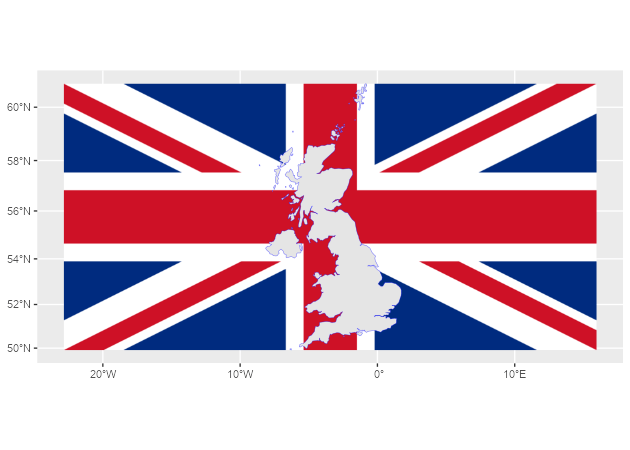
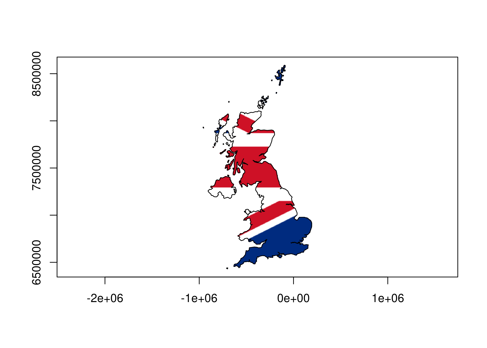

<!-- README.md is generated from README.Rmd. Please edit that file -->

# rasterpic 

<!-- badges: start -->

[](https://CRAN.R-project.org/package=rasterpic)
[](https://cran.r-project.org/web/checks/check_results_rasterpic.html)
[](https://github.com/dieghernan/rasterpic/actions/workflows/check-full.yaml)
[](https://app.codecov.io/gh/dieghernan/rasterpic)
[](https://dieghernan.r-universe.dev/rasterpic)
[](https://www.codefactor.io/repository/github/dieghernan/rasterpic)
[](https://doi.org/10.5281/zenodo.5910095)
[](https://www.repostatus.org/#active)
[](https://CRAN.R-project.org/package=rasterpic)

<!-- badges: end -->

**rasterpic** is a tiny package with one single goal: to transform an
image into a spatial raster.

## Installation

Install `rasterpic` from
[**CRAN**](https://CRAN.R-project.org/package=rasterpic):

``` r
install.packages("rasterpic")
```

You can install the developing version of **rasterpic** with:

``` r
devtools::install_github("dieghernan/rasterpic")
```

Alternatively, you can install **rasterpic** using the
[r-universe](https://dieghernan.r-universe.dev/rasterpic):

``` r
# Install rasterpic in R:
install.packages("rasterpic", repos = c(
  "https://dieghernan.r-universe.dev",
  "https://cloud.r-project.org"
))
```

## Example

This package allows you to create cool maps by using a wide variety of
objects:

- Spatial object of the **sf** package: `sf`, `sfc`, `sfg`or `bbox`.

- Spatial objects of the **terra** package: `SpatRaster`, `SpatVector`,
  `SpatExtent`.

- A vector of coordinates with the form `c(xmin, ymin, xmax, yman)`

An example using a `sf` object:

``` r
library(rasterpic)
library(sf)
library(terra)

# The flag of the United Kingdom
img <- system.file("img/UK_flag.png", package = "rasterpic")
uk <- read_sf(system.file("gpkg/UK.gpkg", package = "rasterpic"))

# Rasterize!
uk_flag <- rasterpic_img(uk, img)

uk_flag
#> class       : SpatRaster 
#> dimensions  : 400, 800, 3  (nrow, ncol, nlyr)
#> resolution  : 5398.319, 5398.319  (x, y)
#> extent      : -2542183, 1776472, 6430573, 8589900  (xmin, xmax, ymin, ymax)
#> coord. ref. : WGS 84 / Pseudo-Mercator (EPSG:3857) 
#> source(s)   : memory
#> colors RGB  : 1, 2, 3 
#> names       : lyr.1, lyr.2, lyr.3 
#> min values  :     0,    14,    35 
#> max values  :   255,   255,   255

# Plot it!
# Using ggplot2 + tidyterra
library(tidyterra)
library(ggplot2)

autoplot(uk_flag) +
  geom_sf(data = uk, color = alpha("blue", 0.5))
```



We can also play with other parameters, as well as modifying the
alignment of the image with respect to the object:

``` r
# Align, crop and mask
uk_flag2 <- rasterpic_img(uk, img, halign = 0.2, crop = TRUE, mask = TRUE)

autoplot(uk_flag2) +
  geom_sf(data = uk, fill = NA)
```



## Image formats admitted

**rasterpic** can parse the following image formats:

- `png` files.
- `jpg/jpeg` files.
- `tif/tiff` files.

## Citation

<p>
Hernangómez D (2024). <em>rasterpic: Create a Spatial Raster from Plain
Images</em>.
<a href="https://doi.org/10.5281/zenodo.5910095">doi:10.5281/zenodo.5910095</a>,
<a href="https://dieghernan.github.io/rasterpic/">https://dieghernan.github.io/rasterpic/</a>.
</p>

A BibTeX entry for LaTeX users is:

    @Manual{R-rasterpic,
      title = {{rasterpic}: Create a Spatial Raster from Plain Images},
      author = {Diego Hernangómez},
      year = {2024},
      version = {0.2.4},
      doi = {10.5281/zenodo.5910095},
      url = {https://dieghernan.github.io/rasterpic/},
      abstract = {Create a spatial raster, as the ones provided by terra, from regular pictures.},
    }
