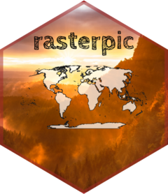
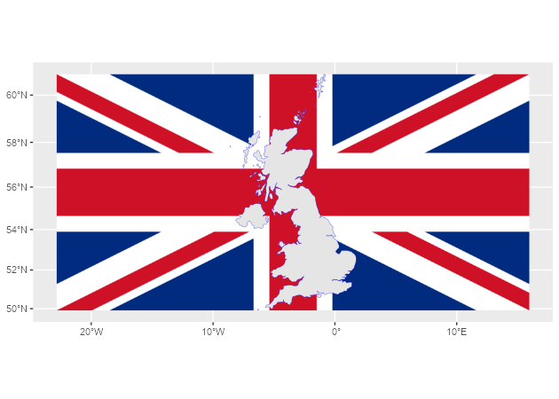
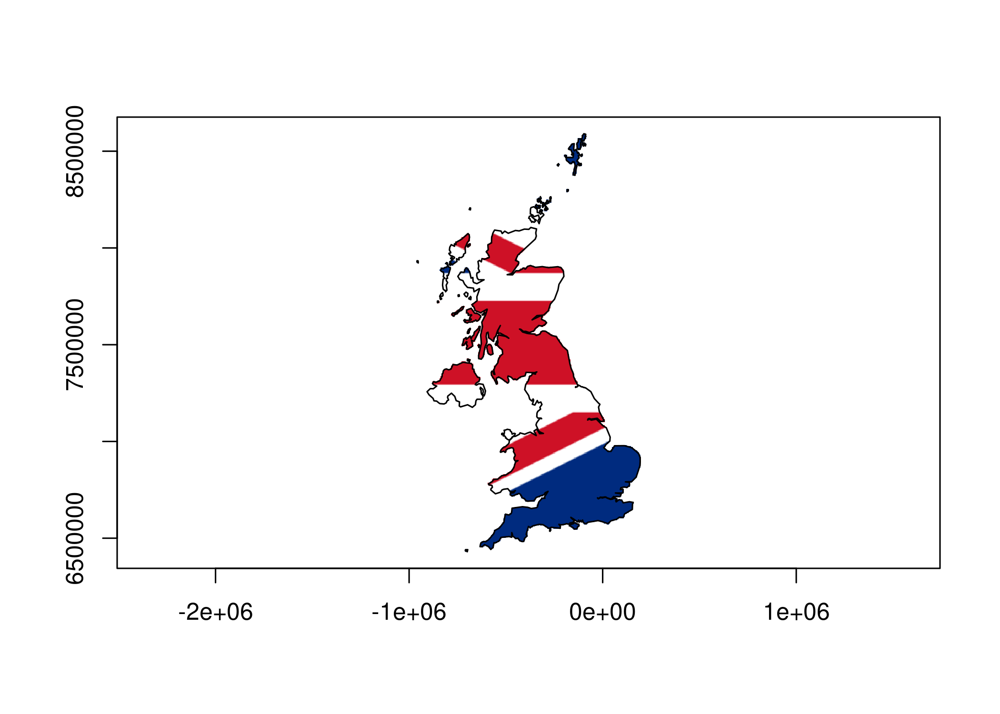

<!-- README.md is generated from README.qmd. Please edit that file -->

# rasterpic <a href="https://dieghernan.github.io/rasterpic/"></a>

<!-- badges: start -->

[](https://CRAN.R-project.org/package=rasterpic)
[](https://cran.r-project.org/web/checks/check_results_rasterpic.html)
[](https://github.com/dieghernan/rasterpic/actions/workflows/check-full.yaml)
[](https://app.codecov.io/gh/dieghernan/rasterpic)
[](https://dieghernan.r-universe.dev/rasterpic)
[](https://www.codefactor.io/repository/github/dieghernan/rasterpic)
[](https://doi.org/10.32614/CRAN.package.rasterpic)
[](https://www.repostatus.org/#active)
[](https://CRAN.R-project.org/package=rasterpic)

<!-- badges: end -->

**rasterpic** is a tiny package with a single goal: to transform an
image into a **terra** `SpatRaster` object (see `?terra::SpatRaster`).

## Installation

<div class="pkgdown-release">

Install **rasterpic** from
[**CRAN**](https://CRAN.R-project.org/package=rasterpic):

``` r
install.packages("rasterpic")
```

</div>

<div class="pkgdown-devel">

Check the documentation for the development version at
<https://dieghernan.github.io/rasterpic/dev/>.

You can install the development version of **rasterpic** with:

``` r
# install.packages("pak")
pak::pak("dieghernan/rasterpic")
```

Alternatively, you can install **rasterpic** using the
[r-universe](https://dieghernan.r-universe.dev/rasterpic):

``` r
# Install rasterpic in R.
install.packages(
  "rasterpic",
  repos = c(
    "https://dieghernan.r-universe.dev",
    "https://cloud.r-project.org"
  )
)
```

</div>

## Example

You can create custom maps with several spatial input classes:

- **sf** classes: `sf`, `sfc`, `sfg` or `bbox`.
- **terra** classes: `SpatRaster`, `SpatVector` and `SpatExtent`.
- **stars** classes: `stars`.
- A numeric coordinate vector of the form `c(xmin, ymin, xmax, ymax)`.

The main function, `rasterpic_img()`, is an S3 generic. The methods for
extent-like inputs use the object extent, and vector methods can also
mask the image to the object shape.

An example using an `sf` object:

``` r
library(rasterpic)
library(sf)
library(terra)

# Use the flag of the United Kingdom.
img <- system.file("img/UK_flag.png", package = "rasterpic")
uk <- read_sf(system.file("gpkg/UK.gpkg", package = "rasterpic"))

class(uk)
#> [1] "sf"         "tbl_df"     "tbl"        "data.frame"

# Rasterize the image.
uk_flag <- rasterpic_img(uk, img)

uk_flag
#> class       : SpatRaster
#> size        : 400, 800, 3  (nrow, ncol, nlyr)
#> resolution  : 5398.319, 5398.319  (x, y)
#> extent      : -2542183, 1776472, 6430573, 8589900  (xmin, xmax, ymin, ymax)
#> coord. ref. : WGS 84 / Pseudo-Mercator (EPSG:3857)
#> source(s)   : memory
#> colors rgb  : 1, 2, 3
#> names       :   r,   g,   b
#> min values  :   0,  14,  35
#> max values  : 255, 255, 255

# Plot with ggplot2 and tidyterra.
library(tidyterra)
library(ggplot2)

autoplot(uk_flag) +
  geom_sf(data = uk, color = alpha("blue", 0.5))
```



We can also adjust other parameters and modify the alignment of the
image with respect to the object:

``` r
# Align, crop and mask.
uk_flag2 <- rasterpic_img(uk, img, halign = 0.2, crop = TRUE, mask = TRUE)

autoplot(uk_flag2) +
  geom_sf(data = uk, fill = NA)
```



## Supported image formats

**rasterpic** can parse the following image formats:

- `png` files
- `jpeg/jpg` files
- `tiff/tif` files

## Citation

<p>

Hernangómez D (2026). <em>rasterpic: Convert Digital Images to
SpatRaster Objects</em>.
<a href="https://doi.org/10.32614/CRAN.package.rasterpic">doi:10.32614/CRAN.package.rasterpic</a>.
<a href="https://dieghernan.github.io/rasterpic/">https://dieghernan.github.io/rasterpic/</a>.
</p>

A BibTeX entry for LaTeX users is:

    @Manual{R-rasterpic,
      title = {{rasterpic}: Convert Digital Images to {SpatRaster} Objects},
      doi = {10.32614/CRAN.package.rasterpic},
      author = {Diego Hernangómez},
      year = {2026},
      version = {0.4.0.9000},
      url = {https://dieghernan.github.io/rasterpic/},
      abstract = {Create SpatRaster objects, as defined by the terra package, from digital images using a specified spatial object as a geographic reference. Supported inputs include objects from the sf, terra and stars packages. The main function is an S3 generic, allowing methods for additional spatial classes.},
    }
