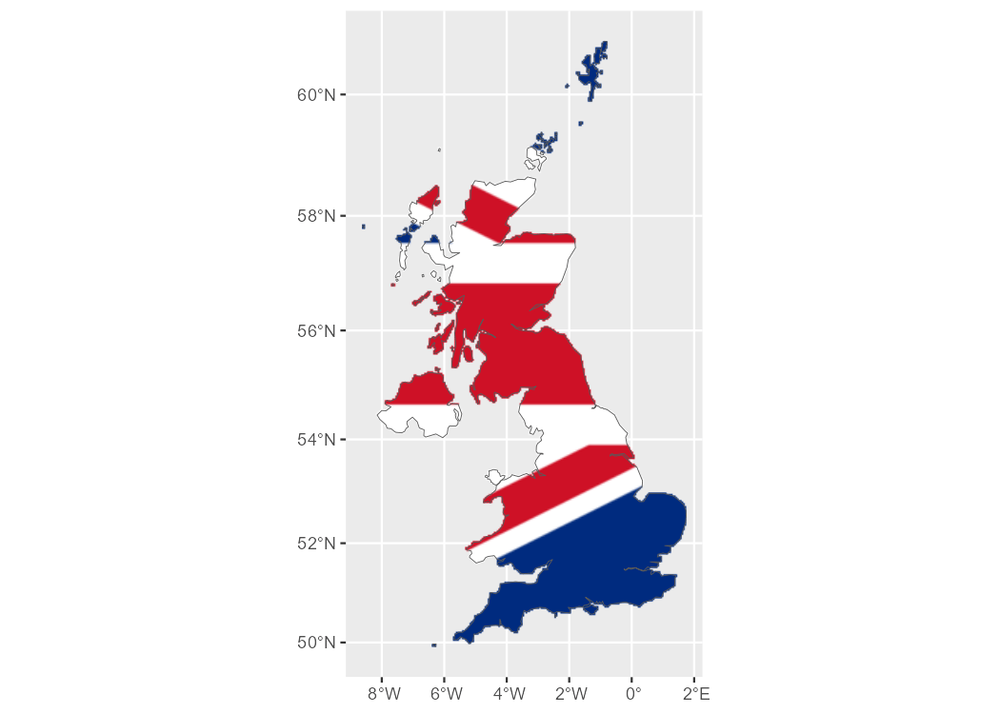

<!-- README.md is generated from README.Rmd. Please edit that file -->

# rasterpic 

<!-- badges: start -->

[](https://github.com/dieghernan/rasterpic/actions/workflows/check-full.yaml)
[](https://app.codecov.io/gh/dieghernan/rasterpic)
[](https://dieghernan.r-universe.dev/)
[](https://www.repostatus.org/#active)

<!-- badges: end -->

**rasterpic** is a tiny package with one single goal: to transform an
image into a spatial raster.

## Installation

You can install the developing version of **rasterpic** with:

``` r
devtools::install_github("dieghernan/rasterpic")
```

Alternatively, you can install **rasterpic** using the
[r-universe](https://dieghernan.r-universe.dev/ui#builds):

``` r
# Enable this universe
options(repos = c(
  dieghernan = "https://dieghernan.r-universe.dev",
  CRAN = "https://cloud.r-project.org"
))
install.packages("rasterpic")
```

## Example

This package allows you to create cool maps by using a pre-existing
spatial object (`sf` or `SpatRaster`) and geotagging a regular image
using the metadata of the object.

``` r
library(rasterpic)
library(sf)
library(terra)

# The flag of the United Kingdom
img <- system.file("img/UK_flag.png",
  package = "rasterpic"
)
uk <- st_read(system.file("gpkg/UK.gpkg",
  package = "rasterpic"
),
quiet = TRUE
)

# Rasterize!
uk_flag <- rasterpic_img(uk, img)

uk_flag
#> class       : SpatRaster 
#> dimensions  : 400, 800, 3  (nrow, ncol, nlyr)
#> resolution  : 5398.319, 5398.319  (x, y)
#> extent      : -2542183, 1776472, 6430573, 8589900  (xmin, xmax, ymin, ymax)
#> coord. ref. : WGS 84 / Pseudo-Mercator (EPSG:3857) 
#> source      : memory 
#> names       : lyr.1, lyr.2, lyr.3 
#> min values  :     0,    13,    34 
#> max values  :   255,   255,   255

# Plot it!

plotRGB(uk_flag)
plot(st_geometry(uk),
  add = TRUE,
  col = adjustcolor("blue",
    alpha.f = 0.5
  )
)
```


We can also play with other parameters, as well as modifying the
alignment of the image with respect to the object:

``` r
# Align, crop and mask
uk_flag2 <- rasterpic_img(uk, img, halign = 0.2, crop = TRUE, mask = TRUE)

plot(st_geometry(uk), axes = TRUE)
plotRGB(uk_flag2, add = TRUE)
plot(st_geometry(uk), col = NA, border = "black", add = TRUE)
```



## Image formats admitted

**rasterpic** can parse the following image formats:

-   `png` files.
-   `jpg/jpeg` files.
-   `tif/tiff` files.

## Citation

To cite the rasterpic package in publications use:

Hernangómez D (2022). *rasterpic: Create a Spatial Raster from Plain
Images*. \<URL: <https://dieghernan.github.io/rasterpic/>\>.

A BibTeX entry for LaTeX users is:

    @Manual{,
      title = {rasterpic: Create a Spatial Raster from Plain Images},
      author = {Diego Hernangómez},
      year = {2022},
      version = {0.1.0.9000},
      url = {https://dieghernan.github.io/rasterpic/},
      abstract = {Creates a spatial raster, as the ones provided by 'terra', from regular pictures.},
    }

## Contribute

Check the GitHub page for [source
code](https://github.com/dieghernan/rasterpic/).
