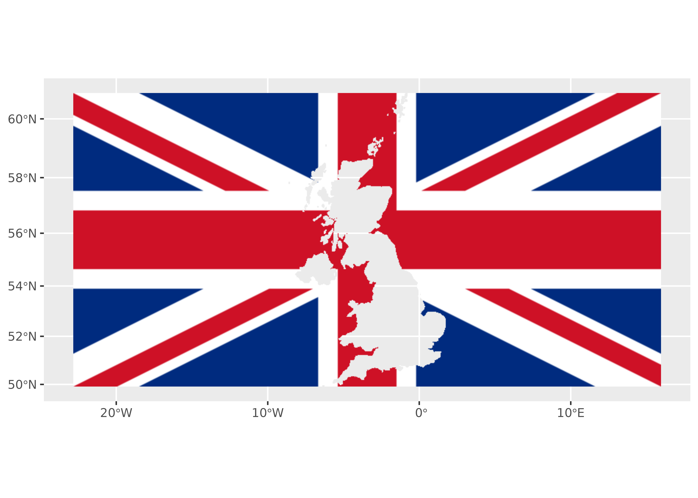
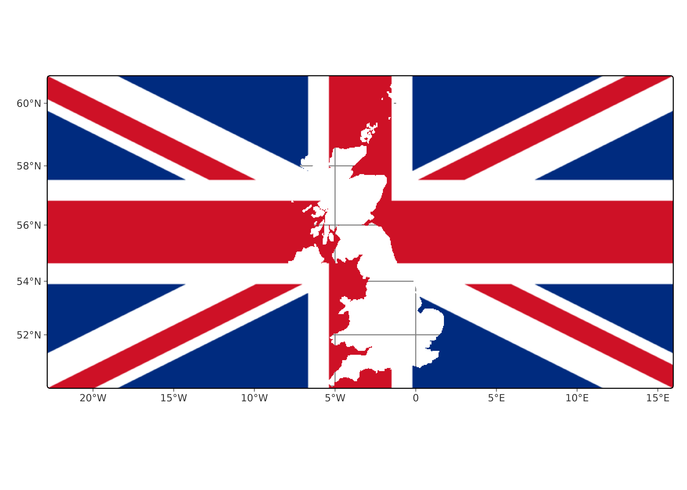

# Plotting SpatRaster objects

This article shows several ways to plot the `SpatRaster` object returned
by
[`rasterpic_img()`](https://dieghernan.github.io/rasterpic/reference/rasterpic_img.md).

## Base plots

The most direct option is to use the base
[`plot()`](https://rspatial.github.io/terra/reference/plot.html) methods
provided by the **terra** package, such as
[`terra::plotRGB()`](https://rspatial.github.io/terra/reference/plotRGB.html):

``` r

library(rasterpic)
library(terra)

# Use the flag of the United Kingdom.
img <- system.file("img/UK_flag.png",
  package = "rasterpic"
)

uk <- sf::st_read(
  system.file("gpkg/UK.gpkg",
    package = "rasterpic"
  ),
  quiet = TRUE
)

uk_img <- rasterpic_img(uk, img, mask = TRUE, inverse = TRUE)
plotRGB(uk_img)
```


Figure 1: Plot with the **terra** package

## With ggplot2 and tidyterra

The **tidyterra** package provides **ggplot2** support for **terra**
`SpatRaster` objects:

``` r

library(ggplot2)
library(tidyterra)

ggplot() +
  geom_spatraster_rgb(data = uk_img)
```



Figure 2: Plot with the **tidyterra** package

## With tmap

The **tmap** package can also create maps from `SpatRaster` objects:

``` r

library(tmap)

tm_shape(uk_img) +
  tm_graticules() +
  tm_rgb()
```



Figure 3: Plot with the **tmap** package

## With mapsf

The **mapsf** package can also plot `SpatRaster` objects:

``` r

library(mapsf)

mf_raster(uk_img)
mf_scale()

mf_inset_on(x = "worldmap", pos = "topright")
mf_worldmap(uk)
mf_inset_off()
```


Figure 4: Plot with the **mapsf** package

## With maptiles

The **maptiles** package can download map tiles from different
providers. It also provides functions for plotting **terra**
`SpatRaster` objects:

``` r

library(maptiles)

other_tile <- get_tiles(uk, crop = TRUE, zoom = 6)

other_tile_crop <- terra::crop(other_tile, uk_img)

plot_tiles(other_tile_crop)
plot_tiles(uk_img, add = TRUE)
```


Figure 5: Plot with the **maptiles** package

## References

Tennekes M (2018). “tmap: Thematic Maps in R.” *Journal of Statistical
Software*, **84**(6), 1–39.
[doi:10.18637/jss.v084.i06](https://doi.org/10.18637/jss.v084.i06).

Giraud T (2026). *mapsf: Thematic Cartography*.
[doi:10.32614/CRAN.package.mapsf](https://doi.org/10.32614/CRAN.package.mapsf).

Hernangómez D (2023). “Using the tidyverse with terra objects: the
tidyterra package.” *Journal of Open Source Software*, **8**(91), 5751.
ISSN 2475-9066.
[doi:10.21105/joss.05751](https://doi.org/10.21105/joss.05751).
<https://doi.org/10.21105/joss.05751>.

Hijmans R, Brown A, Barbosa M (2026). *terra: Spatial Data Analysis*. R
package version 1.9-34, <https://rspatial.org/>.

Wickham H (2016). *ggplot2: Elegant Graphics for Data Analysis*.
Springer-Verlag New York. ISBN 978-3-319-24277-4.
<https://ggplot2.tidyverse.org>.
