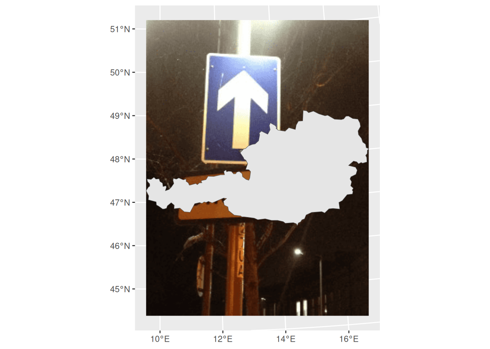
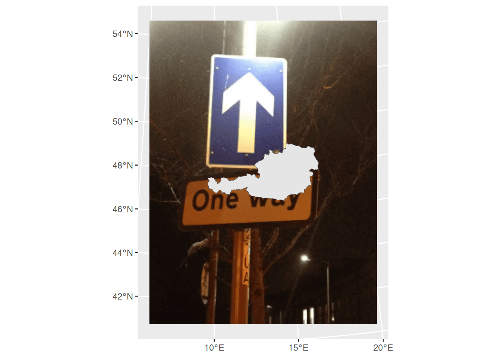
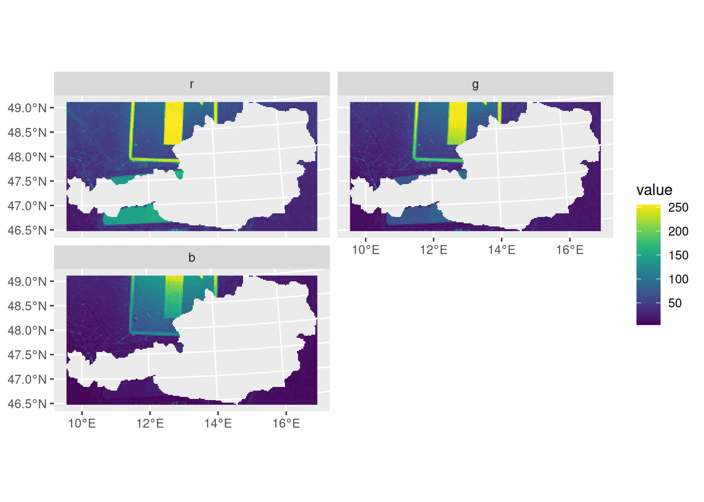

# Get Started

Getting started with **rasterpic** is easy: you need an image (`png`,
`jpeg/jpg`, or `tif/tiff`) and a spatial object from the **sf** or
**terra** package to begin.

## Basic usage

Here we use the shape of Austria as an example:

``` r

library(sf)
library(terra)
library(rasterpic)

# Plot
library(tidyterra)
library(ggplot2)

# Shape and image
x <- read_sf(system.file("gpkg/austria.gpkg", package = "rasterpic"))
img <- system.file("img/vertical.png", package = "rasterpic")

# Create the raster!

default <- rasterpic_img(x, img)

autoplot(default) +
  geom_sf(data = x)
```



Figure 1: Raster map geolocated with the coordinates of Austria

## Options

The function provides several options for expansion, alignment, and
cropping.

### Expand

With this option, the raster extent is expanded beyond the spatial
object:

``` r

expand <- rasterpic_img(x, img, expand = 1)

autoplot(expand) +
  geom_sf(data = x)
```



Figure 2: Example of expansion of image

### Alignment

Choose the alignment of the image within the spatial extent:

``` r

bottom <- rasterpic_img(x, img, valign = 0)

autoplot(bottom) +
  geom_sf(data = x)
```


Figure 3: Example of alignment of image

### Crop and mask

Crop and mask the image:

``` r

mask <- rasterpic_img(x, img, crop = TRUE, mask = TRUE)

autoplot(mask)

maskinverse <- rasterpic_img(x, img, crop = TRUE, mask = TRUE, inverse = TRUE)

autoplot(maskinverse)
```


Figure 4: Example of masked image



Figure 5: Example of inverse masked image

## Supported spatial objects for geotagging

- Spatial objects of the **sf** package: `sf`, `sfc`, `sfg`, or `bbox`.
- Spatial objects of the **terra** package: `SpatRaster`, `SpatVector`,
  `SpatExtent`.
- A numeric coordinate vector of the form `c(xmin, ymin, xmax, ymax)`.

## Supported image formats

**rasterpic** can parse the following image formats:

- `png` files.
- `jpg/jpeg` files.
- `tif/tiff` files.
