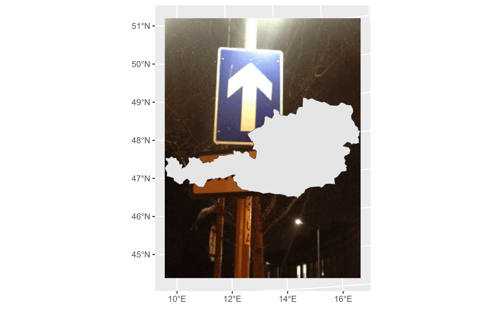
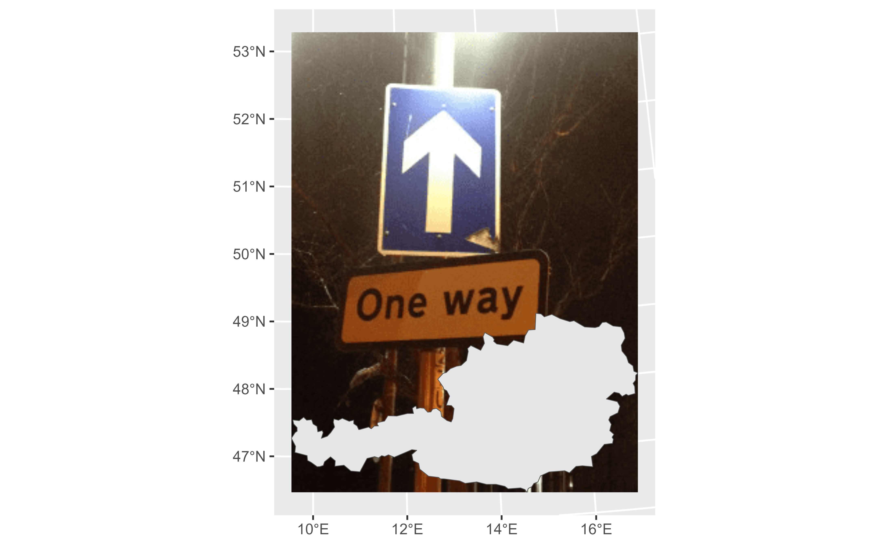
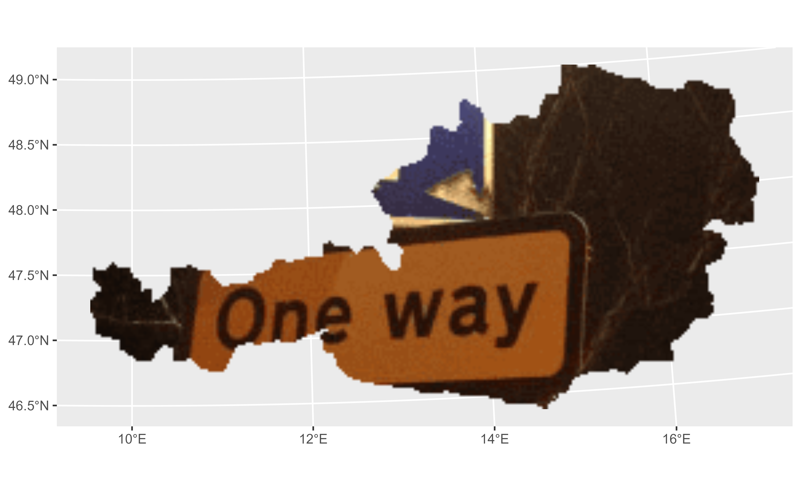
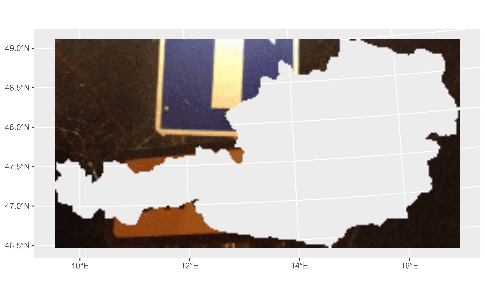

# Get Started

Starting with **rasterpic** is very easy! You just need an image (`png`,
`jpeg/jpg` or `tif/tiff`) and a spatial object from the **sf** or the
**terra** package to start using it.

## Basic usage

Here we use the shape of Austria as an example:

``` r
library(sf)
library(terra)
library(rasterpic)

# Plot
library(tidyterra)
library(ggplot2)

# Shape and image
x <- read_sf(system.file("gpkg/austria.gpkg", package = "rasterpic"))
img <- system.file("img/vertical.png", package = "rasterpic")

# Create the raster!

default <- rasterpic_img(x, img)

autoplot(default) +
  geom_sf(data = x)
```



## Options

The function provides several options for expansion, alignment, and
cropping.

### Expand

With this option, the image is expanded beyond the spatial object:

``` r
expand <- rasterpic_img(x, img, expand = 1)

autoplot(expand) +
  geom_sf(data = x)
```


### Alignment

Decide where to align the image:

``` r
bottom <- rasterpic_img(x, img, valign = 0)

autoplot(bottom) +
  geom_sf(data = x)
```



### Crop and mask

Create impressive maps:

``` r
mask <- rasterpic_img(x, img, crop = TRUE, mask = TRUE)

autoplot(mask)
```



``` r

maskinverse <- rasterpic_img(x, img, crop = TRUE, mask = TRUE, inverse = TRUE)

autoplot(maskinverse)
```



## Supported objects for geotagging

- Spatial objects of the **sf** package: `sf`, `sfc`, `sfg` or `bbox`.
- Spatial objects of the **terra** package: `SpatRaster`, `SpatVector`,
  `SpatExtent`.
- A vector of coordinates with the form `c(xmin, ymin, xmax, ymax)`.

## Supported image formats

**rasterpic** can parse the following image formats:

- `png` files.
- `jpg/jpeg` files.
- `tif/tiff` files.
