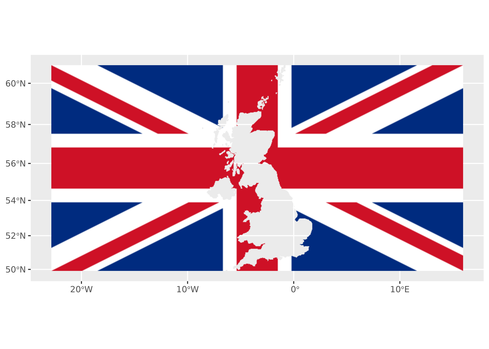

# Plotting terra rasters

This article shows how to plot the `SpatRaster` produced by
[`rasterpic_img()`](https://dieghernan.github.io/rasterpic/dev/reference/rasterpic_img.md)
with several packages.

## Base plots

The most straightforward option is to use the base
[`plot()`](https://rspatial.github.io/terra/reference/plot.html) methods
provided by the package **terra**
([`terra::plotRGB()`](https://rspatial.github.io/terra/reference/plotRGB.html)):

``` r
library(rasterpic)
library(terra)

# The flag of the United Kingdom
img <- system.file("img/UK_flag.png",
  package = "rasterpic"
)

uk <- sf::st_read(
  system.file("gpkg/UK.gpkg",
    package = "rasterpic"
  ),
  quiet = TRUE
)

uk_img <- rasterpic_img(uk, img, mask = TRUE, inverse = TRUE)
plotRGB(uk_img)
```


Figure 1: Plot with terra package

## With ggplot2 + tidyterra

**tidyterra** provides full support for **terra** `SpatRaster` objects:

``` r
library(ggplot2)
library(tidyterra)

ggplot() +
  geom_spatraster_rgb(data = uk_img)
```



Figure 2: Plot with tidyterra package

## With tmap

**tmap** can also be used to create great maps:

``` r
library(tmap)

tm_shape(uk_img) +
  tm_graticules() +
  tm_rgb()
```


Figure 3: Plot with tmap package

## With mapsf

**mapsf** also provides this functionality:

``` r
library(mapsf)

mf_raster(uk_img)
mf_scale()

mf_inset_on(x = "worldmap", pos = "topright")
mf_worldmap(uk)
mf_inset_off()
```


Figure 4: Plot with mapsf package

## With maptiles

**maptiles** is an interesting package that provides the ability to
download map tiles from different providers. It also has a specific
function for plotting **terra** `SpatRaster` objects:

``` r
library(maptiles)

other_tile <- get_tiles(uk, crop = TRUE, zoom = 6)

other_tile_crop <- terra::crop(other_tile, uk_img)

plot_tiles(other_tile_crop)
plot_tiles(uk_img, add = TRUE)
```


Figure 5: Plot with maptiles package

## References

Tennekes M (2018). “tmap: Thematic Maps in R.” *Journal of Statistical
Software*, **84**(6), 1–39.
[doi:10.18637/jss.v084.i06](https://doi.org/10.18637/jss.v084.i06).

Giraud T (2026). *mapsf: Thematic Cartography*.
[doi:10.32614/CRAN.package.mapsf](https://doi.org/10.32614/CRAN.package.mapsf).

Hernangómez D (2023). “Using the tidyverse with terra objects: the
tidyterra package.” *Journal of Open Source Software*, **8**(91), 5751.
ISSN 2475-9066,
[doi:10.21105/joss.05751](https://doi.org/10.21105/joss.05751),
<https://doi.org/10.21105/joss.05751>.

Hijmans R (2026). *terra: Spatial Data Analysis*. R package version
1.8-93, <https://rspatial.org/>.

Wickham H (2016). *ggplot2: Elegant Graphics for Data Analysis*.
Springer-Verlag New York. ISBN 978-3-319-24277-4,
<https://ggplot2.tidyverse.org>.
