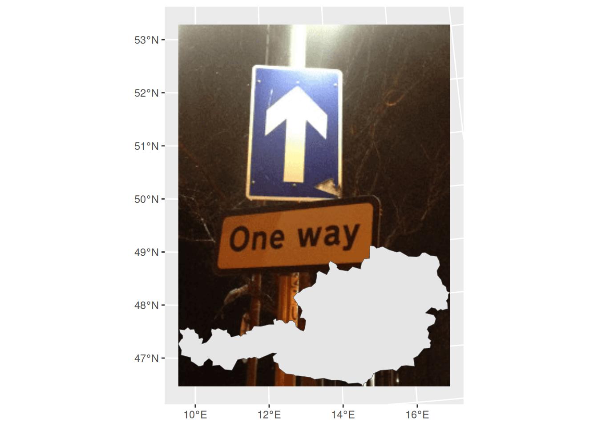
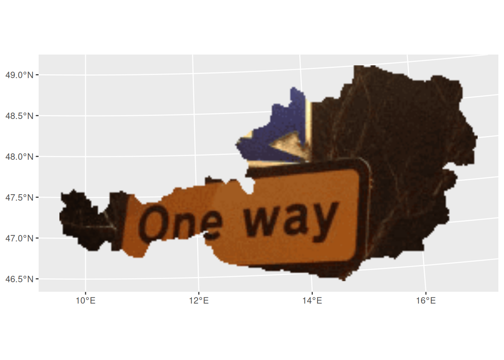

# Get started

Getting started with **rasterpic** is straightforward: you need an image
file (`png`, `jpeg`/`jpg` or `tiff`/`tif`) and a supported spatial
input, such as an object from the **sf**, **terra** or **stars**
packages.

## Basic usage

This example geotags an image using the shape of Austria:

``` r

library(sf)
library(terra)
library(rasterpic)

# Load plotting packages.
library(tidyterra)
library(ggplot2)

# Set the spatial object and image.
x <- read_sf(system.file("gpkg/austria.gpkg", package = "rasterpic"))
img <- system.file("img/vertical.png", package = "rasterpic")

# Geotag the image.
default <- rasterpic_img(x, img)

autoplot(default) +
  geom_sf(data = x)
```


Figure 1: Raster map geotagged with the coordinates of Austria

## Options

[`rasterpic_img()`](https://dieghernan.github.io/rasterpic/dev/reference/rasterpic_img.md)
provides options for expansion, alignment, cropping and masking.

### Expand

The `expand` argument expands the raster extent beyond the spatial
object:

``` r

expand <- rasterpic_img(x, img, expand = 1)

autoplot(expand) +
  geom_sf(data = x)
```


Figure 2: Example image expansion

### Alignment

The `halign` and `valign` arguments control the alignment of the image
within the spatial extent:

``` r

bottom <- rasterpic_img(x, img, valign = 0)

autoplot(bottom) +
  geom_sf(data = x)
```



Figure 3: Example image alignment

### Crop and mask

The `crop`, `mask` and `inverse` arguments control whether the raster is
cropped and masked to the object shape:

``` r

mask <- rasterpic_img(x, img, crop = TRUE, mask = TRUE)

autoplot(mask)

maskinverse <- rasterpic_img(x, img, crop = TRUE, mask = TRUE, inverse = TRUE)

autoplot(maskinverse)
```



Figure 4: Example of masked image


Figure 5: Example of inverse masked image

## Supported spatial input classes

[`rasterpic_img()`](https://dieghernan.github.io/rasterpic/dev/reference/rasterpic_img.md)
supports the following spatial input classes:

- **sf** classes: `sf`, `sfc`, `sfg` or `bbox`.
- **terra** classes: `SpatRaster`, `SpatVector` and `SpatExtent`.
- **stars** classes: `stars`.
- A numeric coordinate vector of the form `c(xmin, ymin, xmax, ymax)`.

[`rasterpic_img()`](https://dieghernan.github.io/rasterpic/dev/reference/rasterpic_img.md)
is an S3 generic. Methods for extent-like inputs use the object extent,
and vector methods can also mask the image to the object shape.

## Supported image formats

**rasterpic** can parse the following image formats:

- `png` files.
- `jpeg`/`jpg` files.
- `tiff`/`tif` files.
