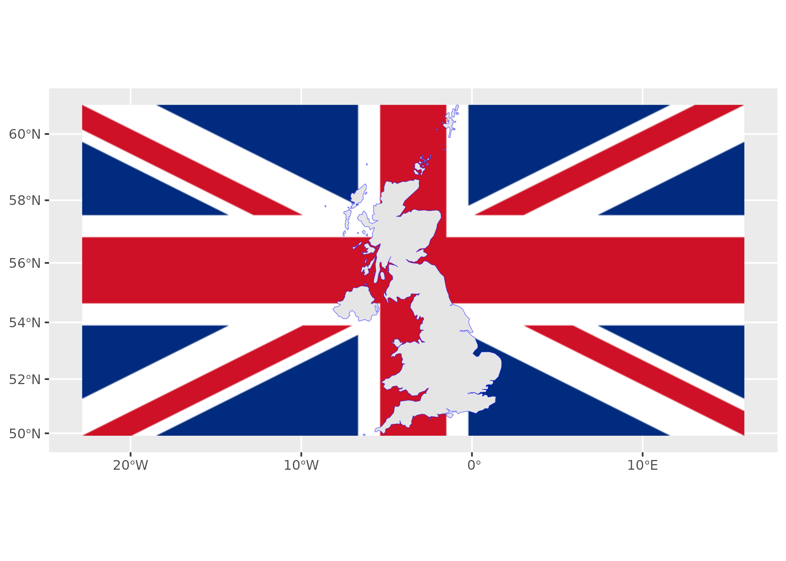
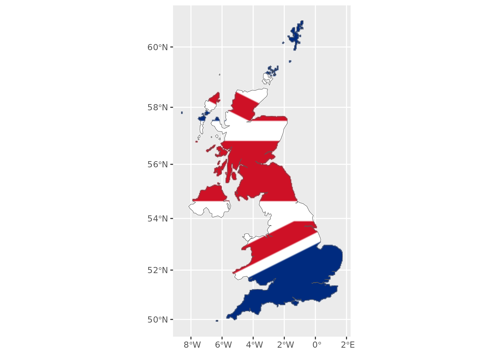

# rasterpic

**rasterpic** is a tiny package with a single goal: to transform an
image into a `SpatRaster` object (see
[`?terra::SpatRaster`](https://rspatial.github.io/terra/reference/SpatRaster-class.html)).

## Installation

Install **rasterpic** from
[**CRAN**](https://CRAN.R-project.org/package=rasterpic):

``` r
install.packages("rasterpic")
```

## Example

This package allows you to create custom maps by using a wide variety of
objects:

- Spatial object created with the **sf** package: `sf`, `sfc`, `sfg` or
  `bbox`.
- Spatial objects created with the **terra** package: `SpatRaster`,
  `SpatVector`, `SpatExtent`.
- A vector of coordinates with the form `c(xmin, ymin, xmax, ymax)`

An example using an `sf` object:

``` r
library(rasterpic)
library(sf)
library(terra)

# The flag of the United Kingdom
img <- system.file("img/UK_flag.png", package = "rasterpic")
uk <- read_sf(system.file("gpkg/UK.gpkg", package = "rasterpic"))


class(uk)
#> [1] "sf"         "tbl_df"     "tbl"        "data.frame"

# Rasterize the image!
uk_flag <- rasterpic_img(uk, img)

uk_flag
#> class       : SpatRaster 
#> size        : 400, 800, 3  (nrow, ncol, nlyr)
#> resolution  : 5398.319, 5398.319  (x, y)
#> extent      : -2542183, 1776472, 6430573, 8589900  (xmin, xmax, ymin, ymax)
#> coord. ref. : WGS 84 / Pseudo-Mercator (EPSG:3857) 
#> source(s)   : memory
#> colors RGB  : 1, 2, 3 
#> names       :   r,   g,   b 
#> min values  :   0,  14,  35 
#> max values  : 255, 255, 255

# Plot it!
# Using ggplot2 + tidyterra
library(tidyterra)
library(ggplot2)

autoplot(uk_flag) +
  geom_sf(data = uk, color = alpha("blue", 0.5))
```



We can also adjust other parameters, as well as modifying the alignment
of the image with respect to the object:

``` r
# Align, crop and mask
uk_flag2 <- rasterpic_img(uk, img, halign = 0.2, crop = TRUE, mask = TRUE)

autoplot(uk_flag2) +
  geom_sf(data = uk, fill = NA)
```



## Supported image formats

**rasterpic** can parse the following image formats:

- `png` files.
- `jpg/jpeg` files.
- `tif/tiff` files.

## Citation

Hernangómez D (2026). *rasterpic: Convert Digital Images into SpatRaster
Objects*.
[doi:10.32614/CRAN.package.rasterpic](https://doi.org/10.32614/CRAN.package.rasterpic),
<https://dieghernan.github.io/rasterpic/>.

A BibTeX entry for LaTeX users is:

``` R
@Manual{R-rasterpic,
  title = {{rasterpic}: Convert Digital Images into {SpatRaster} Objects},
  doi = {10.32614/CRAN.package.rasterpic},
  author = {Diego Hernangómez},
  year = {2026},
  version = {0.3.1},
  url = {https://dieghernan.github.io/rasterpic/},
  abstract = {Generate SpatRaster objects, as defined by the terra package, from digital images, using a specified spatial object as a geographical reference.},
}
```
